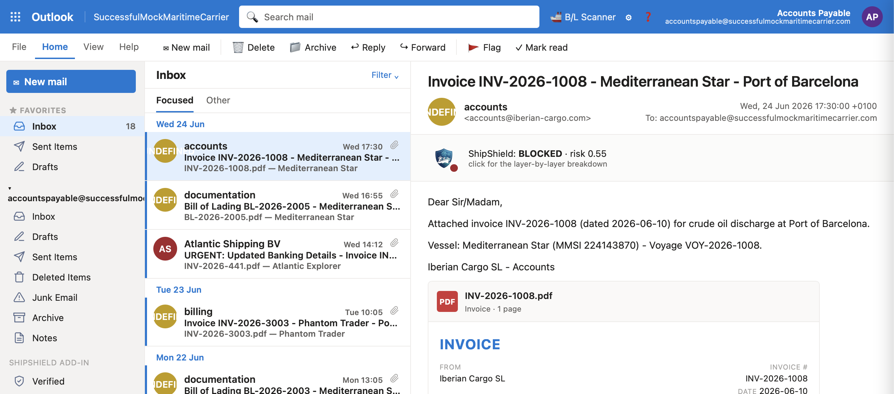
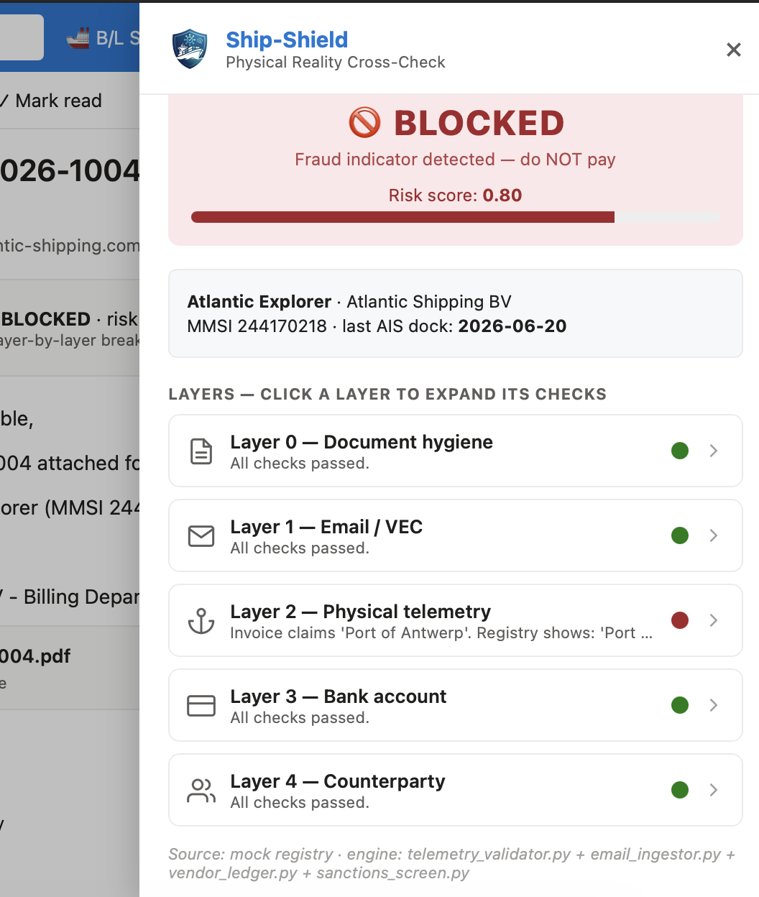
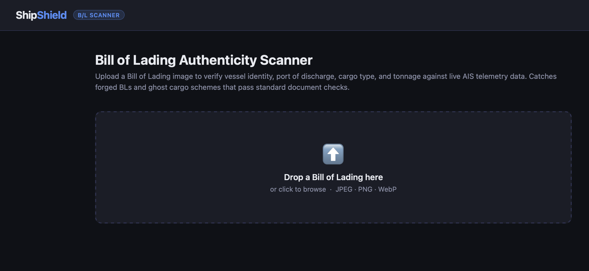

# SmartInvoiceAI — Physical Telemetry Validation Engine

> Maritime invoice fraud detection that checks not just *what* a document says, but *whether the shipment actually happened*.


---

## The Problem

Maritime shipping is a prime target for **Vendor Email Compromise (VEC)** and **Bill of Lading (B/L) fraud**. Attackers forge invoices and B/Ls, inject them into live payment threads, and redirect funds — often undetected because standard tools only validate document structure, not physical reality. Over **65% of B/L frauds are discovered after funds are already lost**, with direct losses ranging from **$300M–$500M** annually and broader supply-chain damage exceeding **$8B**.

## The Solution

SmartInvoiceAI cross-references invoice and B/L data against **live AIS vessel tracking** to confirm the shipment physically occurred. It catches what document-only tools miss: ghost voyages, duplicate sales, DWT overstatements, and post/ante-dated cargo — plus email header anomalies that signal VEC attacks.







## How to Use

### 1. Clone the repo
```bash
git clone https://github.com/JaanuNan/SmartInvoiceAI
cd SmartInvoiceAI
```

### 2. Configure secrets
```toml
# secrets.toml
GROQ_API_KEY = "your_groq_api_key"
MARINETRAFFIC_API_KEY = "your_marinetraffic_api_key" 
```

### 3. Run
```bash
uvicorn bol_app:app --reload --port 8502
```

Then open your browser and drag-drop a Bill of Lading image (JPEG / PNG / WebP) or upload a `.eml` email file. You'll get a **CLEAR / REVIEW / BLOCKED** verdict with a per-flag risk score breakdown in seconds.

---

## Tech Stack

| Layer | Technology |
|---|---|
| Backend | FastAPI + Uvicorn |
| Frontend | Vanilla HTML/CSS/JS |
| AI Model | LLaMA-4 Scout 17B via Groq API |
| ML | Isolation Forest (scikit-learn) |
| Validation | Pydantic v2 |
| AIS Data | MarineTraffic REST API |
| Email Parsing | Python `imaplib` / RFC 2822 |

---

*Built by Akar Sarpal, Anup Bangalore, Pablo Fernandez, Vicky Kohnen — Cybersecurity / Hack Tank (2026)*
